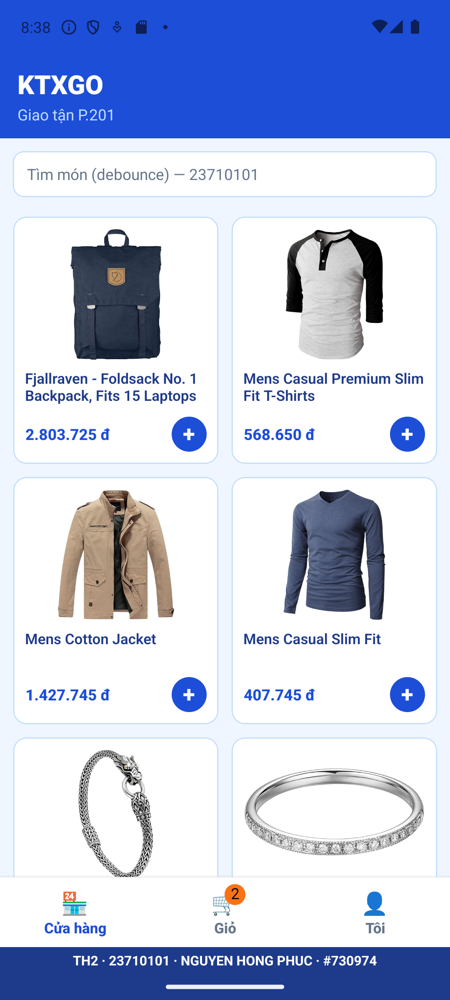
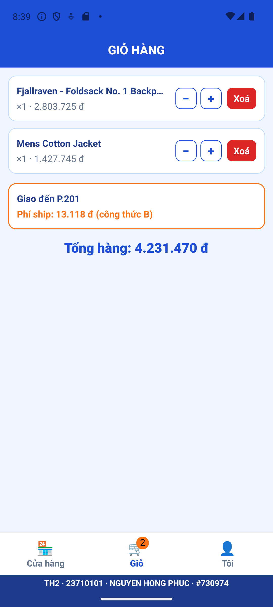

NGUYEN HONG PHUC · 23710101 · https://github.com/nhpucs/23710101_TH2.git · #730974 · Số cuối 1: Watermark Dưới | phone | Shop→Giỏ→Tôi | selection | Phí B | Detail card

# KTXGo_23710101 — Thực hành 2 (Lập trình cho thiết bị di động)

App giao đồ tận phòng KTX: Auth Stack (Login) → Main Tabs (Cửa hàng · Giỏ · Tôi), tab Cửa hàng có Stack Home (lưới 2 cột) → Chi tiết.

## Công nghệ
React Native CLI 0.87 + TypeScript · React Navigation 7 (Native Stack + Bottom Tabs) · Zustand + persist AsyncStorage · TanStack Query + Axios · FlashList v1.8.3 (`numColumns={2}`, `estimatedItemSize`) · `@react-native-community/geolocation` + `PermissionsAndroid` · Haptic bằng `Vibration` · `Linking.openSettings()`.

## Định danh (src/constants/student.ts)
| Hằng | Giá trị |
|---|---|
| examStamp() | 730974 |
| DEBOUNCE_MS | 400 |
| STALE_TIME_MS | 11000 |
| PRICE_MULTIPLIER | 25500 |
| BASE_SHIP_FEE | 9000 |
| ROOM_LABEL | P.201 |

Phí ship (công thức B): `BASE_SHIP_FEE + Math.round(km * 1500) + 2000`, km = Haversine tới cổng KTX (10.8221, 106.6869).

## Chạy
npm install
cd android; .\gradlew.bat app:installDebug; cd ..
npm start -- --reset-cache

## Ảnh

